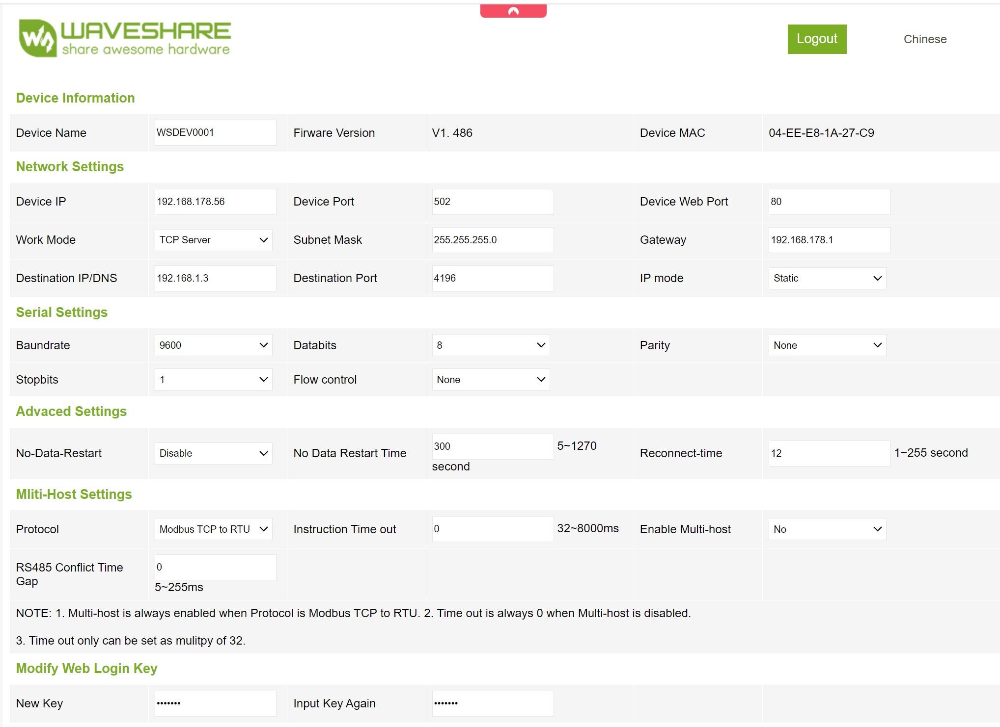

# dbus-growattmod-pvinverter

dbus driver for victron cerbo gx / venus os for Growatt MOD inverter
TL3-X(MAX、MID、MAC Type)

## Purpose

This script is intended to help integrate a Growatt MOD inverter inverter into the Venus OS and thus also into the VRM
portal.

I use a Multiplus II GX, which I have integrated via Ethernet in the house network. 
Important: I use the RS485 (Modbus RTU) output of the Growatt. 
Using a Waveshare RS485 to RJ45 Ethernet Converter Module I can access from venus os via Modbus TCP.
This means that Growatt Cloud access including the app remains unaffected.

## Installation

1. Copy the full project directory to the /data/etc folder on your venus:

    - /data/dbus-growattmod-pvinverter/
	
   Info: The /data directory persists data on venus os devices while updating the firmware

   Easy way:
   ```
   wget https://github.com/hicomer/dbus-growattmod-pvinverter/archive/refs/heads/main.zip
   unzip main.zip -d /data
   mv /data/dbus-growattmod-pvinverter-main /data/dbus-growattmod-pvinverter
   chmod a+x /data/dbus-growattmod-pvinverter/install.sh
   rm main.zip
   ```


3. Edit the config.py file

   `nano /data/dbus-growattmod-pvinverter/config.py`

5. Check Modbus TCP Connection to gridinverter

   `python /data/dbus-growattmod-pvinverter/connector_modbus.py`

6. Run install.sh

   `sh /data/dbus-growattmod-pvinverter/install.sh`

### Debugging

You can check the status of the service with svstat:

`svstat /service/dbus-growattmod-pvinverter`

It will show something like this:

`/service/dbus-growattmod-pvinverter: up (pid 10078) 325 seconds`

If the number of seconds is always 0 or 1 or any other small number, it means that the service crashes and gets
restarted all the time.

When you think that the script crashes, start it directly from the command line:

`python /data/dbus-growattmod-pvinverter/dbus-growattmod-pvinverter.py`

Also useful:

`tail -f /var/log/dbus-growattmod/current | tai64nlocal`

### Stop the script

`svc -d /service/dbus-growattmod-pvinverter`

### Start the script

`svc -u /service/dbus-growattmod-pvinverter`


### Restart the script 

If you want to restart the script, for example after changing it, just run the following command:

`sh /data/dbus-growattmod-pvinverter/restart.sh`

## Uninstall the script

Run

   ```
sh /data/dbus-growattmod-pvinverter/uninstall.sh
rm -r /data/dbus-growattmod-pvinverter/
   ```

# Waveshare RS485 gateway config example




# Thank you

## Used as template

https://github.com/kcbam/dbus-huaweisun2000-pvinverter

## Used libraries

modified version of https://github.com/olivergregorius/sun2000_modbus

## this project is inspired by

https://github.com/RalfZim/venus.dbus-fronius-smartmeter

https://github.com/fabian-lauer/dbus-shelly-3em-smartmeter.git

https://github.com/victronenergy/velib_python.git
